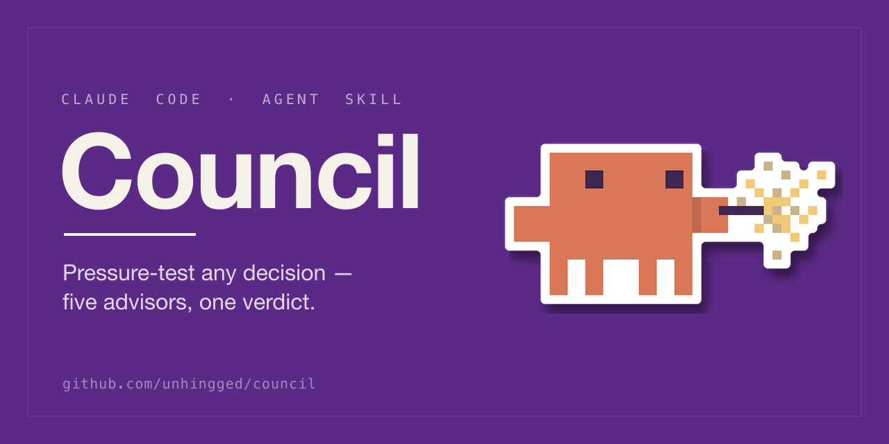
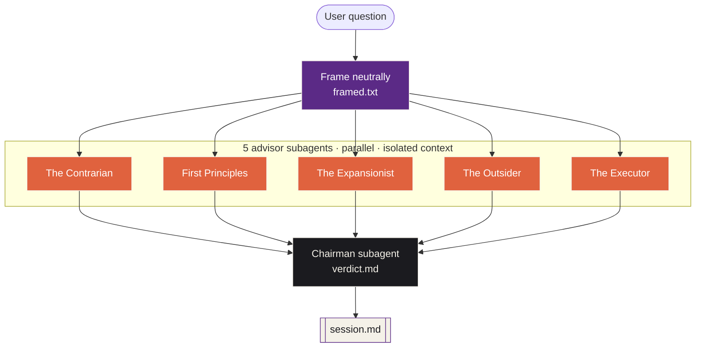

<p align="center">
  
</p>

<h1 align="center">Council</h1>

<p align="center"><em>An agentic decision pressure-test for Claude Code</em> — a <strong>Claude Code plugin</strong> &amp; <strong>Agent Skill</strong>.</p>

A Claude Code skill that runs questions through an **agentic** council of five
advisors. Each advisor runs as a **separate subagent** with its own isolated
context. They argue in parallel, optionally over multiple debate rounds, and a
Chairman subagent renders the verdict.

## Why subagents

A single Claude session role-playing five voices knows what the other voices will
say while it's writing each one, so the "disagreement" tends to be cosmetic — five
lanes that quietly complement each other.

This skill spawns the advisors as **independent subagents** with no shared context.
None of them sees the others until the (optional) debate rounds, and even then only
an anonymized, shuffled version. They can contradict each other, argue from
incompatible premises, and refuse to converge — which is the whole point of
pressure-testing.

> In blind A/B/C testing (an independent model judged anonymized outputs without
> knowing which was which), the agentic approaches — subagents and a separate
> `claude -p` orchestrator — both beat a single-session simulation on verdict
> quality and usefulness, and tied each other. Subagents were lighter and avoided
> a context-bleed the subprocess approach occasionally showed, so subagents are the
> engine.

## The advisors

| Advisor | Role |
|---|---|
| **The Contrarian** | Finds the fatal flaw |
| **The First Principles Thinker** | Asks if you're solving the right problem |
| **The Expansionist** | Finds the upside everyone missed |
| **The Outsider** | Catches the curse of knowledge |
| **The Executor** | Cares only what you do Monday morning |

The **Chairman** runs last, sees the full transcript, and renders a structured
verdict. The Chairman is a pure judge — they weigh and pick, they don't add new
arguments.

## Architecture



> **Optional debate rounds (2–3):** each advisor runs again seeing the others'
> previous round — anonymized and shuffled — so they engage with arguments, not
> authors. Then the orchestrator stitches the files into `session.md`.

## Requirements

- **Claude Code** with subagent support

No scripts, no Python, no dependencies — the skill is instructions plus six
advisor/Chairman personas.

## Installation

This repo is both a **Claude Code plugin marketplace** and an **Agent Skill**, so it
installs two ways.

**Claude Code plugin** (`/plugin`):

```
/plugin marketplace add unhingged/council
/plugin install council@unhingged
```

**Agent Skills / skills.sh** (`npx skills`, works across Claude Code, Cursor, and
other agents):

```bash
npx skills add unhingged/council --skill council
```

Both resolve to the same single source at `skills/council/SKILL.md` — there's no
duplicated copy to keep in sync. (`--skill council` is needed because the skill
lives in the `skills/` subdirectory rather than the repo root, which is what lets the
same tree also be a Claude Code plugin.)

**Manual / project-local:** copy `skills/council/` into your `~/.claude/skills/`
(personal) or `.claude/skills/` (project) directory.

## Repository layout

```
council/
├── .claude-plugin/
│   ├── plugin.json          # declares the "council" plugin
│   └── marketplace.json     # marketplace "unhingged" listing the plugin (source ".")
├── skills/council/
│   ├── SKILL.md             # the skill — read by both install channels
│   └── prompts/             # the six advisor + Chairman personas
├── README.md  LICENSE
```

## Usage

Invoke explicitly. The skill is heavy by design and only triggers when you ask:

```
> Council this: should I quit my job to start a company?
```

The skill (see `SKILL.md`) walks the orchestrating Claude through: framing the
question, dispatching the five advisor subagents in parallel, optionally running
debate rounds (with the previous round anonymized and shuffled so advisors react to
arguments, not authors), dispatching the Chairman, and stitching the files into
`session.md`.

## Output structure

Every session produces `session.md` with:

1. `## The question` — neutral restatement
2. `## The advisors` (per round) — five independent responses
3. `## Verdict` — Chairman ruling: what survived / what didn't / most right /
   recommendation / a note on the council

## Credit

The original "LLM Council Facilitator" framing and the five advisor roles come from
a publicly circulated prompt concept. This skill adds the agentic
subagent orchestration, configurable debate rounds with anonymized cross-feed, the
pure-judge Chairman pattern, and the output contract.

## License

MIT — see `LICENSE`.
